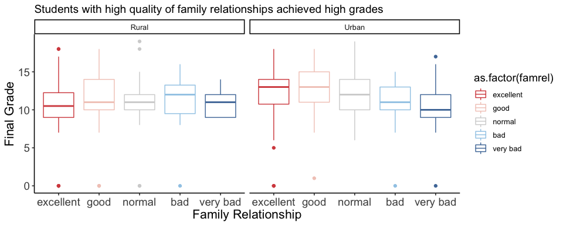
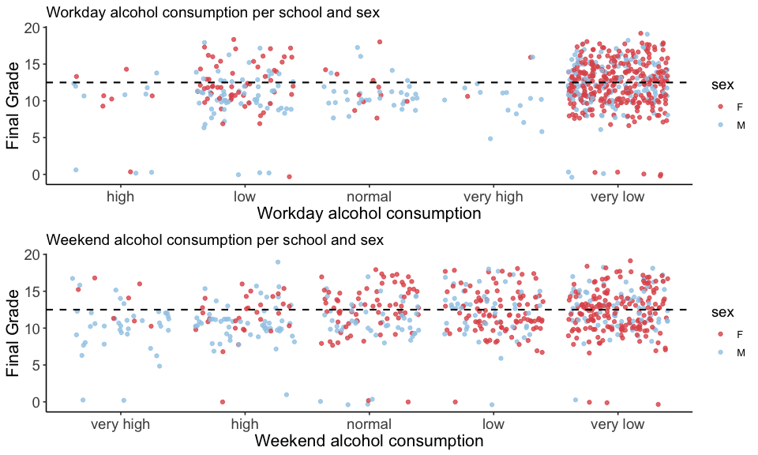
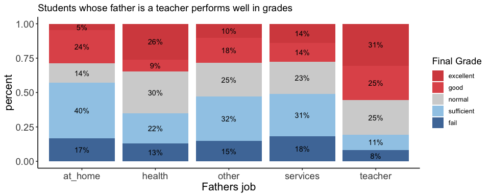
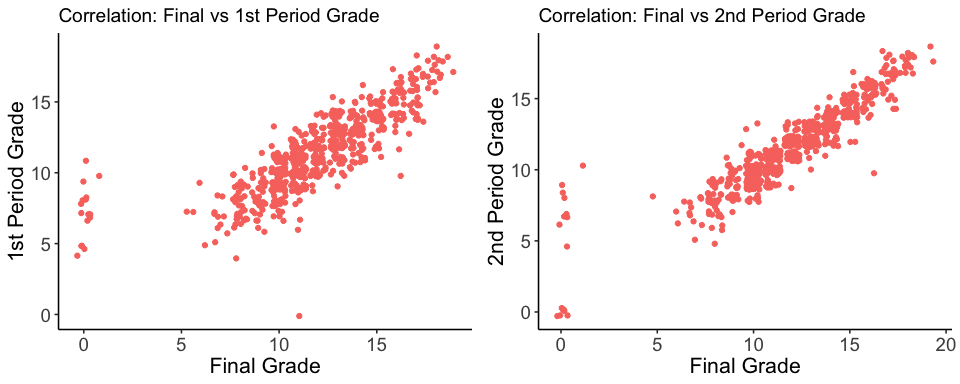
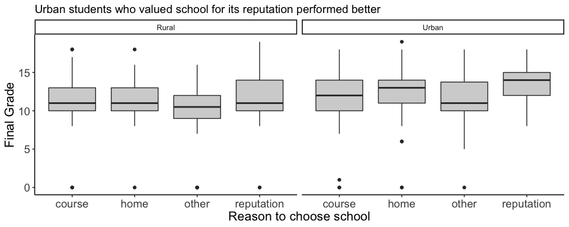

FP\_executive\_summary\_charts
================
Hrishikesh Telang, Naoto Minakawa, Somendra Tripathi
12/10/2018

``` r
# Install packages
library(tidyverse)
library(ggbeeswarm)
library(ggthemes)
library(ggridges)
library(GGally)
library(cluster)
library(carData)
library(extracat)
library(pgmm)
library(vcd)

# Load datasets
student_por <- read_csv('student-por.csv')
student_mat <- read_csv('student-mat.csv')

# Set theme
theme_set(c(theme_classic(12),plot.title = element_text(face = "bold", size = 12) 
            ,plot.subtitle = element_text(face = "bold", color = "grey35", size = 11) 
            ,plot.caption = element_text(color = "grey68",size=5)
            ,axis.text = element_text(size=10)))


# data claening
student_por <- student_por %>%
  mutate(G3_erasmus = if_else(G3>=16, 'excellent',
                            if_else(G3>=14&G3<=15, 'good',
                                    if_else(G3>=12&G3<=13, 'normal',
                                            if_else(G3>=10&G3<=11, 'sufficient',
                                                    'fail'))))) %>%
  mutate(G3_erasmus = factor(G3_erasmus,
                             c('excellent','good','normal','sufficient','fail'))) %>%
  mutate(famrel = if_else(famrel==5, 'excellent',
                              if_else(famrel==4, 'good',
                                      if_else(famrel==3, 'normal',
                                              if_else(famrel==2, 'bad',
                                                      'very bad'))))) %>%
  mutate(famrel = factor(famrel,
                         c('excellent','good','normal','bad','very bad'))) %>%
  mutate(Dalc = if_else(Dalc==5, 'very high',
                              if_else(Dalc==4, 'high',
                                      if_else(Dalc==3, 'normal',
                                              if_else(Dalc==2, 'low',
                                                      'very low'))))) %>%
  mutate(Dalcl = factor(Dalc,
                         c('very high','high','normal','low','very low'))) %>%
  mutate(Walc = if_else(Walc==5, 'very high',
                              if_else(Walc==4, 'high',
                                      if_else(Walc==3, 'normal',
                                              if_else(Walc==2, 'low',
                                                      'very low'))))) %>%
  mutate(Walc = factor(Walc,
                         c('very high','high','normal','low','very low'))) %>%
  mutate(address = if_else(address=="U", 'Urban',
                              if_else(address=="R", 'Rural',
                                      'Other')))
```

Home Environment
================

``` r
student_por %>%
  ggplot(aes(x = as.factor(famrel), y = G3, color = as.factor(famrel))) +
  facet_wrap(~address) +
  geom_boxplot() +
  scale_color_manual(values = c("#D64E4E","#F2CAC1","#d3d3d3","#a0cbe8","#4e79a7")) +
  guides(fill=guide_legend(title="Family Relationship")) +
  xlab("Family Relationship") +
  ylab("Final Grade") +
  theme(axis.text=element_text(size=14),
        axis.title=element_text(size=16),
        legend.title=element_text(size=14)) +
  ggtitle("Students with high quality of family relationships achieved high grades")
```



Social
======

``` r
c3 <- ggplot(student_por, aes(x=Dalc, y=G3, color=sex))+
  geom_jitter(alpha=0.8)+
  scale_colour_manual(values=c("#e15759", "#a0cbe8"))+
  xlab("Workday alcohol consumption")+
  ylab("Final Grade")+
  ggtitle("Workday alcohol consumption per school and sex")+
  geom_hline(yintercept=12.5, linetype="dashed", 
             color = "black", size=.75) +
  theme(axis.text=element_text(size=14),
        axis.title=element_text(size=16),
        legend.title=element_text(size=14))

c4 <- ggplot(student_por, aes(x=Walc, y=G3, color=sex))+
  geom_jitter(alpha=0.8)+
  scale_colour_manual(values=c("#e15759", "#a0cbe8"))+
  xlab("Weekend alcohol consumption")+
  ylab("Final Grade")+
  ggtitle("Weekend alcohol consumption per school and sex")+
  geom_hline(yintercept=12.5, linetype="dashed", 
             color = "black", size=.75) +
  theme(axis.text=element_text(size=14),
        axis.title=element_text(size=16),
        legend.title=element_text(size=14))

gridExtra::grid.arrange(c3,c4, nrow=2)
```



Parents
=======

``` r
student_por %>% 
  group_by(G3_erasmus, Fjob) %>%
  tally() %>%
  group_by(Fjob) %>%
  mutate(percent = n/sum(n))  %>%
  arrange(desc(G3_erasmus)) %>%
  ggplot(aes(x = Fjob, y = percent)) + 
  geom_col(aes(fill = G3_erasmus)) +
  geom_text(aes(label = paste(round(percent,2) * 100,"%",sep = "")),
            position = position_stack(vjust = 0.5)) +
  scale_colour_manual(values = c("#D64E4E","#e15759","#d3d3d3","#a0cbe8","#4e79a7")) +
  scale_fill_manual(values = c("#D64E4E","#e15759","#d3d3d3","#a0cbe8","#4e79a7")) +
  labs(fill = "G3_erasmus") +
  guides(fill=guide_legend(title="Final Grade")) +
  xlab("Fathers job") +
  theme(axis.text=element_text(size=14),
        axis.title=element_text(size=16),
        legend.title=element_text(size=14)) +
  ggtitle("Students whose father is a teacher performs well in grades")
```



Academics
=========

``` r
g1 <- ggplot(student_por, aes(G3,G1,color = "blue"))+
  geom_jitter() + 
  xlab("Final Grade") +
  ylab("1st Period Grade") +
  theme(legend.position = "none",
        axis.text=element_text(size=14),
        axis.title=element_text(size=16)) +
  ggtitle("Correlation: Final vs 1st Period Grade")

g2 <- ggplot(student_por, aes(G3,G2,color = "blue"))+
  geom_jitter() + 
  xlab("Final Grade") +
  ylab("2nd Period Grade") +
  theme(legend.position = "none",
        axis.text=element_text(size=14),
        axis.title=element_text(size=16)) +
  ggtitle("Correlation: Final vs 2nd Period Grade")

gridExtra::grid.arrange(g1,g2, nrow=1)
```



Others
======

``` r
student_por$address[student_por$address == 'U'] <- "Urban"
student_por$address[student_por$address == 'R'] <- "Rural"

student_por %>%
  ggplot(aes(x = reason, y = G3)) +
  facet_wrap(~address) +
  geom_boxplot(fill="#d3d3d3") +
  xlab("Reason to choose school") +
  ylab("Final Grade") +
  theme(legend.position = "none",
        axis.text=element_text(size=14),
        axis.title=element_text(size=16)) +
  ggtitle("Urban students who valued school for its reputation performed better")
```


