``` r
library(ggbeeswarm)
library(cluster)
library(tidyverse)
library(ggthemes)
library(carData)
library(extracat)
library(pgmm)
library(GGally)
library(vcd)

student_por <- read_csv('student-por.csv')
student_mat <- read_csv('student-mat.csv')


theme_set(c(theme_classic(12),plot.title = element_text(face = "bold", size = 12) 
            ,plot.subtitle = element_text(face = "bold", color = "grey35", size = 11) 
            ,plot.caption = element_text(color = "grey68",size=5)
            ,axis.text = element_text(size=10)))
```

##### Reference to the paper

[USING DATA MINING TO PREDICT SECONDARY SCHOOL STUDENT PERFORMANCE](http://www3.dsi.uminho.pt/pcortez/student.pdf)

##### Student file contains the following number of observations :

-   Mathematics : 395
-   Portuguese : 677
-   Both : 382

##### Coverting GPA - G3, G2, G1 to erasmus system discribed in the paper

#### 1) Urban VS. Rural setting

##### How do the GPAs vary?

``` r
student_por$address[student_por$address == 'U'] <- "Urban"
student_por$address[student_por$address == 'R'] <- "Rural"


address_gpa<- student_por %>%
  ggplot(aes(x = address, y = G3, color = address)) +
  geom_boxplot() +
  scale_color_manual(values = c("#e15759","#a0cbe8"))+
ggtitle("Higher GPAs for student who live in Urban areas")


freq <- ggplot(student_por, aes(x = address, fill = address)) +
  geom_bar() +
  scale_fill_manual(values = c("#e15759","#a0cbe8"))+
  ggtitle("More students from urban than rural in the report")

gridExtra::grid.arrange(address_gpa,freq,ncol=2)
```

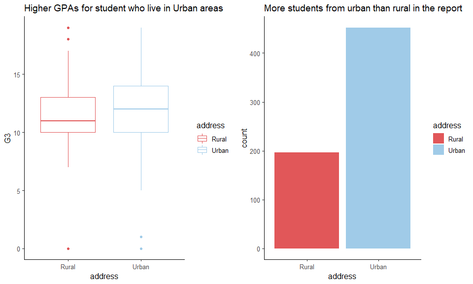

##### Internet : Do they have better access to internet?

``` r
student_por %>%
  ggplot(aes(x = internet, y = G3, color = internet)) +
  geom_boxplot() +
  facet_wrap(~address)+
  scale_color_manual(values = c("#e15759","#a0cbe8"))+
ggtitle("Higher GPAs for student who live in Urban areas")
```

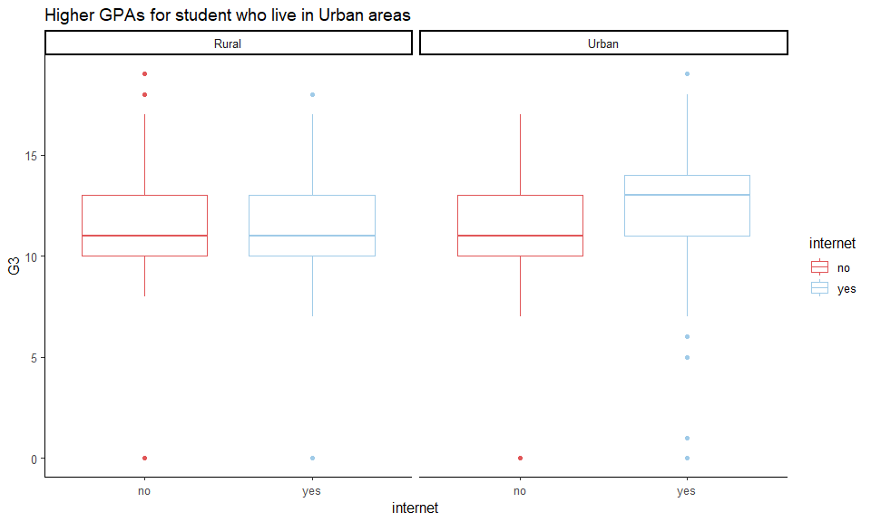

##### Schools : is a particular school more linient ? and urban people go to that school?

``` r
student_por %>%
  ggplot(aes(x = school, y = G3, color = school)) +
  geom_boxplot() +
  #facet_wrap(~)+
  scale_color_manual(values = c("#e15759","#a0cbe8"))+
ggtitle("Higher GPAs for student who live in Urban areas")
```

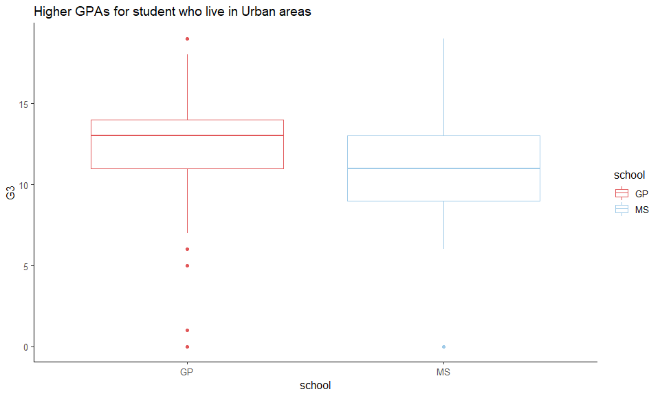

##### Percentage urban VS schools they go to

``` r
student_por %>% 
  group_by(school, address) %>% tally() %>%
  group_by(address) %>%
  mutate(percent = n/sum(n))  %>%
  arrange(desc(school)) %>%
  
  ggplot(aes(x = address, y = percent)) + 
  
  geom_col(aes(fill = school)) +
  geom_text(aes(label = paste(round(percent,2) * 100, "%",sep = "")),position = position_stack(vjust = 0.5))+
  scale_colour_manual(values = c("#e15759","#a0cbe8")) +
  scale_fill_manual(values = c("#e15759","#a0cbe8")) +
  labs(fill = "school") +
  ggtitle("76% urban people study at GP vs 40% rural")
```

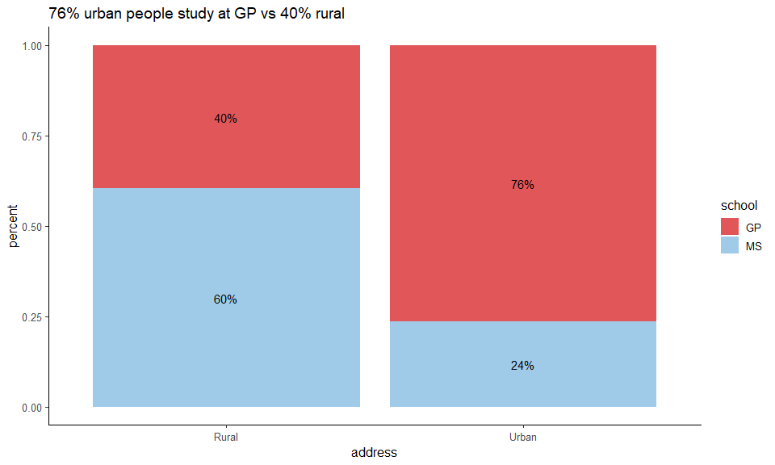

#### 2) What role does famsize play?

``` r
famsize_gpa<- student_por %>%
  ggplot(aes(x = famsize, y = G3, color = famsize)) +
  geom_boxplot() +
  scale_color_manual(values = c("#e15759","#a0cbe8"))+
ggtitle("No difference in grades")


freq <- ggplot(student_por, aes(x = famsize, fill = famsize)) +
  geom_bar() +
  scale_fill_manual(values = c("#e15759","#a0cbe8"))+
  ggtitle("Most of the families have sizes greater than 3")

gridExtra::grid.arrange(famsize_gpa,freq,ncol=2)
```

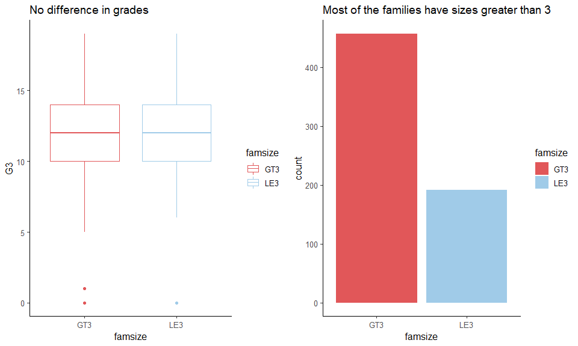

##### What if the setting is Urban/Rural

``` r
student_por %>%
  ggplot(aes(x = address, y = G3, color = famsize)) +
  geom_boxplot() +
  facet_wrap(~Pstatus) + 
  scale_color_manual(values = c("#e15759","#a0cbe8"))+
ggtitle("No difference in grades")
```

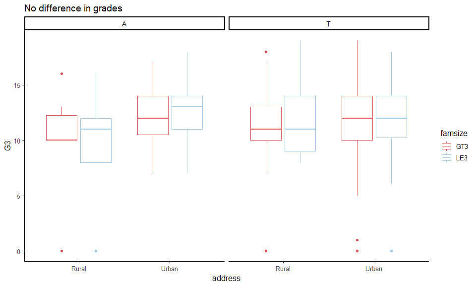

##### What if the parents are leaving separately?

``` r
student_por %>%
  ggplot(aes(x = famsize, y = G3, color = famsize)) +
  geom_boxplot() +
  facet_wrap(~Pstatus) + 
  scale_color_manual(values = c("#e15759","#a0cbe8"))+
ggtitle("No difference in grades")
```

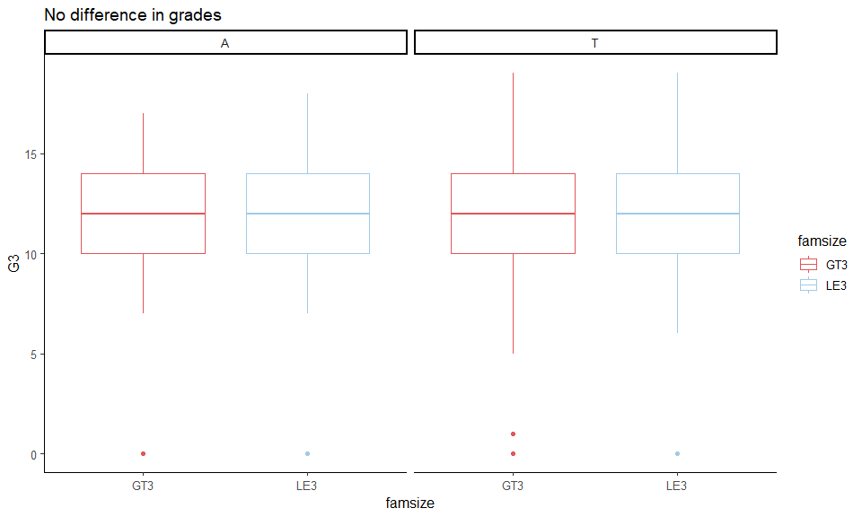

##### Does parents living separately have any impact?

``` r
student_por %>%
  ggplot(aes(x = Pstatus, y = G3, color = Pstatus)) +
  geom_boxplot() +
  scale_color_manual(values = c("#e15759","#a0cbe8"))+
ggtitle("No difference in grades")
```

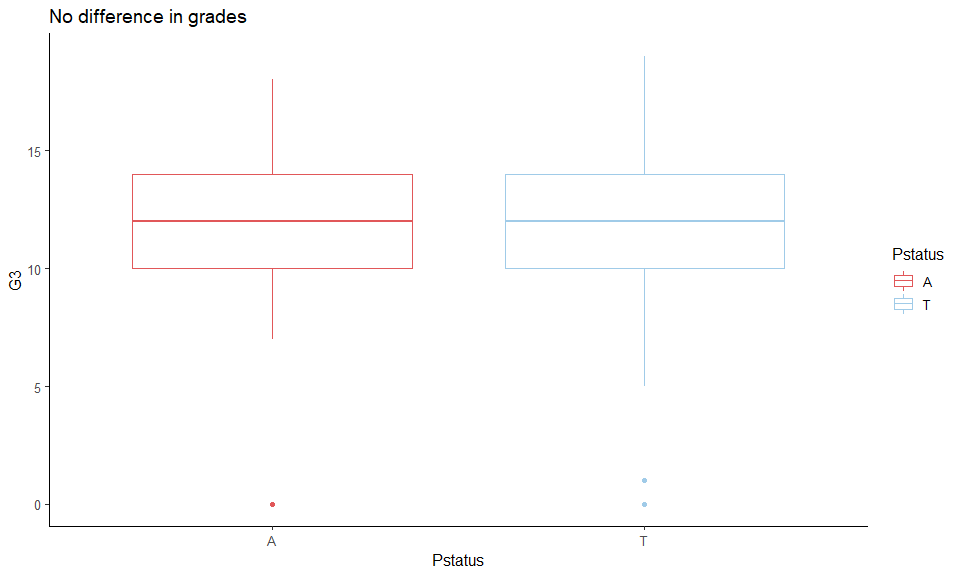

##### How about gender and pstatus?

``` r
x <- student_por %>%
  ggplot(aes(x = Pstatus, y = G3, color = Pstatus)) +
  geom_boxplot() +
  facet_wrap(~sex)+
  scale_color_manual(values = c("#e15759","#a0cbe8"))+
ggtitle("Males students whose parents were separated performed better")


freq_fem <- ggplot(filter(student_por,sex=="F"), aes(x = Pstatus, fill = Pstatus)) +
  geom_bar() +
  scale_fill_manual(values = c("#e15759","#a0cbe8"))+
  ggtitle("Females: parents staying together")

freq_male <- ggplot(filter(student_por,sex=="M"), aes(x = Pstatus, fill = Pstatus)) +
  geom_bar() +
  scale_fill_manual(values = c("#e15759","#a0cbe8"))+
  ggtitle("Males: parents staying together")

y <- gridExtra::grid.arrange(freq_fem,freq_male, ncol = 2)
```


``` r
gridExtra::grid.arrange(x,y,ncol=1,nrow=2)
```

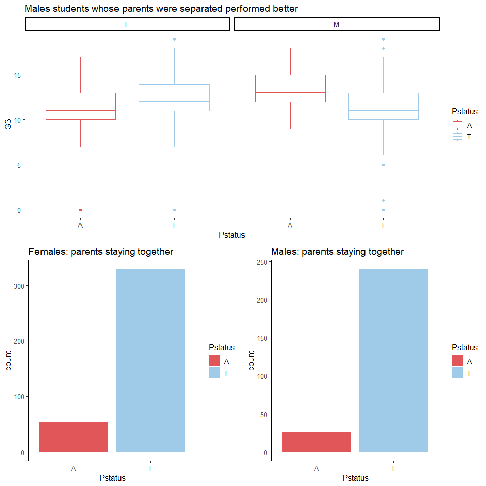

#### 3) famrel : quality of family relationships (numeric: from 1 - very bad to 5 - excellent)

``` r
student_por$famrel <- factor(student_por$famrel,labels =  c('very_low', 'low', 'medium', 'high', 'very_high'),ordered = TRUE)

student_por %>%
  ggplot(aes(x = as.factor(famrel), y = G3, color = as.factor(famrel))) +
  geom_boxplot() +
  scale_color_manual(values = c("#D64E4E","#F2CAC1","#d3d3d3","#a0cbe8","#4e79a7"))+
ggtitle("Students with high quality of family relationships achieved high grades")
```

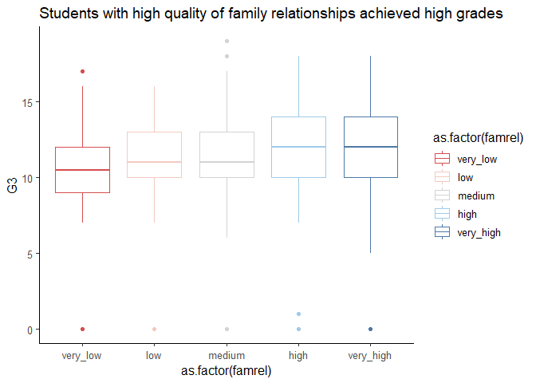

##### Do Urban families have quality relationships?

``` r
student_por %>%
  ggplot(aes(x = as.factor(famrel), y = G3, color = as.factor(famrel))) +
  facet_wrap(~address) +
  geom_boxplot() +
  scale_color_manual(values = c("#D64E4E","#F2CAC1","#d3d3d3","#a0cbe8","#4e79a7"))+
ggtitle("Students with high quality of family relationships achieved high grades")
```

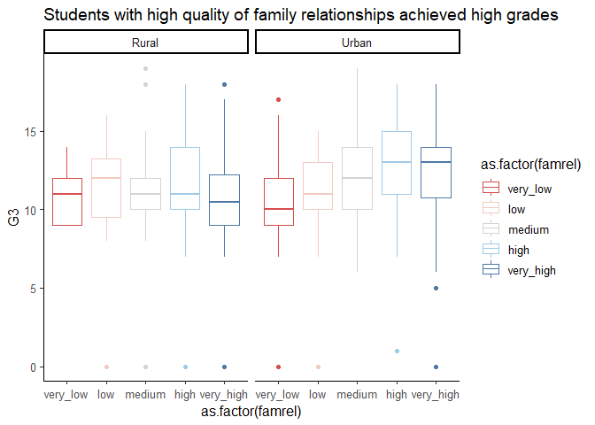
