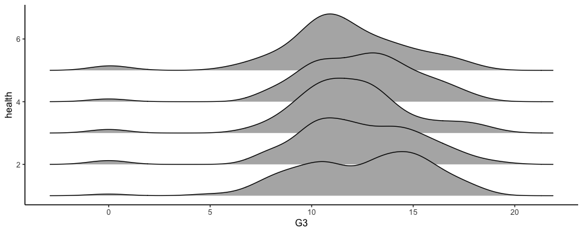

Final Project EDAV
================

EDAV Final Project
==================

Data Loading and Cleaning
-------------------------

``` r
library(tidyverse)

# Load data
student_mat <- read_csv("/Users/naoto/Downloads/student-alcohol-consumption/student-mat.csv")
student_por <- read_csv("/Users/naoto/Downloads/student-alcohol-consumption/student-por.csv")

# Merge student in math course and portuguese language course
student <- student_mat %>%
  full_join(student_por,
            by = c("school","sex","age","address","famsize",
                   "Pstatus","Medu","Fedu","Mjob","Fjob",
                   "reason","nursery","internet")) %>%
  mutate(G3=if_else(is.na(`G3.x`), `G3.y`, `G3.x`)) %>%
  mutate(guardian=if_else(is.na(`guardian.x`), `guardian.y`, `guardian.x`)) %>%
  mutate(absences=if_else(is.na(`absences.x`), `absences.y`, `absences.x`)) %>%
  mutate(failures=if_else(is.na(`failures.x`), `failures.y`, `failures.x`)) %>%
  mutate(activities=if_else(is.na(`activities.x`), `activities.y`, `activities.x`)) %>%
  #mutate(course=if_else(is.na(`G3.x`), "por", "mat")) %>%
  mutate(FinalGrade = if_else(G3>=16, 'excellent',
                            if_else(G3>=14&G3<=15, 'good',
                                    if_else(G3>=12&G3<=13, 'satisfactory',
                                            if_else(G3>=10&G3<=11, 'sufficient',
                                                    'fail'))))) %>%
  mutate(FinalGrade = factor(FinalGrade,
                             c('excellent',
                               'good',
                               'satisfactory',
                               'sufficient',
                               'fail'))) %>%
  mutate(Medu=recode(Medu,
                      `0`='none',
                      `1`='primary education',
                      `2`='5th to 9th grade',
                      `3`='secondary education',
                      `4`='higher education')) %>%
  mutate(Fedu=recode(Fedu,
                      `0`='none',
                      `1`='primary education',
                      `2`='5th to 9th grade',
                      `3`='secondary education',
                      `4`='higher education')) %>%
  mutate(Medu=factor(Medu,
                     c('none',
                       'primary education',
                       '5th to 9th grade',
                       'secondary education',
                       'higher education'))) %>%
  mutate(Fedu=factor(Fedu,
                     c('none',
                       'primary education',
                       '5th to 9th grade',
                       'secondary education',
                       'higher education')))
```

Association between Father's job and Students' Score
----------------------------------------------------

If father's job is teacher, students' grades tend to be higher.

``` r
library(vcd)
vcd::mosaic(FinalGrade~Fjob, student, rot_labels=c(30,0,0,0), direction=c("v","h"))
```


``` r
ggplot(student, aes(x = reorder(`Fjob`, G3, median),
                    y = G3)) + 
  geom_boxplot(varwidth = TRUE) +
  coord_flip() +
  theme_grey(14)
```


Association between Mother's job and Students' Score
----------------------------------------------------

If Mother's job is health, students' grades tend to be higher.

``` r
library(vcd)
vcd::mosaic(FinalGrade~Mjob, student, rot_labels=c(30,0,0,0), direction=c("v","h"))
```


``` r
ggplot(student, aes(x = reorder(`Mjob`, G3, median),
                    y = G3)) + 
  geom_boxplot(varwidth = TRUE) +
  coord_flip() +
  theme_grey(14)
```


Association between Parents' job and Students' Score
----------------------------------------------------

What if both parents are at home.

``` r
student <- student %>%
  mutate(Mjob2=if_else(Mjob=='at_home', 'at_home','working')) %>%
  mutate(Fjob2=if_else(Fjob=='at_home', 'at_home','working'))

library(vcd)
vcd::mosaic(FinalGrade~Fjob2+Mjob2, student, rot_labels=c(30,0,30,0), direction=c("v","v","h"))
```


Association between Father's education and Students' Score
----------------------------------------------------------

If father took higher education, students' grades tend to be higher.

``` r
library(vcd)
vcd::mosaic(FinalGrade~Fedu, student, rot_labels=c(30,0,0,0), direction=c("v","h"))
```


``` r
ggplot(student, aes(x = reorder(`Fedu`, G3, median),
                    y = G3)) + 
  geom_boxplot(varwidth = TRUE) +
  coord_flip() +
  theme_grey(14)
```


Association between Mother's education and Students' Score
----------------------------------------------------------

If Mother took higher education, students' grades tend to be higher.

``` r
library(vcd)
vcd::mosaic(FinalGrade~Medu, student, rot_labels=c(30,0,0,0), direction=c("v","h"))
```


``` r
ggplot(student, aes(x = reorder(`Medu`, G3, median),
                    y = G3)) + 
  geom_boxplot(varwidth = TRUE) +
  coord_flip() +
  theme_grey(14)
```


Association between Parents' education and Students' Score
----------------------------------------------------------

Wen both parents did not take higher eductation, students are less likely to earn excellent and good grades.

``` r
student <- student %>%
  mutate(Medu2=if_else(Medu=='higher education', 'higher education','other')) %>%
  mutate(Fedu2=if_else(Fedu=='higher education', 'higher education','other'))

library(vcd)
vcd::mosaic(FinalGrade~Fedu2+Medu2, student, rot_labels=c(30,0,30,0), direction=c("v","v","h"))
```


Association between Absences and Students' Score
------------------------------------------------

### Obtain quantiles for absences

``` r
# absences quantiles
boxplot(student$absences, horizontal = TRUE, las = 1)
fivenumnames <- c("min", "lower-hinge", "median", "upper-hinge", "max")
D <- student$absences
fivenum(D) %>% set_names(fivenumnames)
```

    ##         min lower-hinge      median upper-hinge         max 
    ##           0           0           2           7          75

``` r
text(fivenum(D)[c(1,3,5)], 1.25, round(fivenum(D)[c(1,3,5)],1), col = "red")
text(fivenum(D)[c(2,4)], .75, round(fivenum(D),1)[c(2,4)], col = "red")
```


``` r
# Bucketing absences to 4 qunatiles
student <- student %>%
  mutate(AbsenceFrequency = if_else(absences>=7, 'Most frequent',
                                    if_else(absences>2&absences<7, 'Second frequent',
                                            if_else(absences>0&absences<=2, 'Average',
                                                    if_else(absences==0, 'No Absences',
                                                            'Other'))))) %>%
  mutate(AbsenceFrequency = factor(AbsenceFrequency,
                                   c('Most frequent','Second frequent','Average','No Absences','Other')))

library(vcd)
vcd::mosaic(FinalGrade~AbsenceFrequency, student, rot_labels=c(30,0,0,0), direction=c("v","h"))
```


``` r
# Install packages
library(tidyverse)
library(ggbeeswarm)
library(ggthemes)
library(ggridges)
library(GGally)
library(cluster)
library(carData)
library(extracat)
library(pgmm)
library(vcd)

# Load datasets
student_por <- read_csv('student-por.csv')
student_mat <- read_csv('student-mat.csv')

# Set theme
theme_set(c(theme_classic(12),plot.title = element_text(face = "bold", size = 12) 
            ,plot.subtitle = element_text(face = "bold", color = "grey35", size = 11) 
            ,plot.caption = element_text(color = "grey68",size=5)
            ,axis.text = element_text(size=10)))


# data claening
student_por <- student_por %>%
  mutate(G3_erasmus = if_else(G3>=16, 'excellent',
                            if_else(G3>=14&G3<=15, 'good',
                                    if_else(G3>=12&G3<=13, 'satisfactory',
                                            if_else(G3>=10&G3<=11, 'sufficient',
                                                    'fail'))))) %>%
  mutate(G3_erasmus = factor(G3_erasmus,
                             c('excellent','good','satisfactory','sufficient','fail')))
```

### Analysis for Parents Group

We observed parents occupation and education background affects students grade. We will introduce analysis results followingly.

First of all, students whose parents job is teacher performs better than other students.

Regarding father's job, students whose father is teacher performs significantly better than other students. Students whose father is working in health industry performs relatively well.

``` r
mosaic(G3_erasmus ~ Fjob,student_por,
            gp = gpar(fill = c("#D64E4E","#e15759","#d3d3d3","#a0cbe8","#4e79a7")),
            rot_labels=c(45,0,0,75),
            direction=c("v","h"))
```


Similarly, students whose mother is teacher performs significantly better than other students. Students whose mother is working in health industry performs also well, whereas the effect of parents job to be health related is not so significant in father's job case.

``` r
mosaic(G3_erasmus ~ Mjob,student_por,
            gp = gpar(fill = c("#D64E4E","#e15759","#d3d3d3","#a0cbe8","#4e79a7")),
            rot_labels=c(45,0,0,75),
            direction=c("v","h"))
```


Secondly, parent education is also associated with students' grade. As indicated in 2.2, the larger number means the higher education.

When father took higher education, students perform better in their grades. In the chart below, we can see students grades become better, as father's education goes higher.

``` r
mosaic(G3_erasmus ~ Fedu,student_por,
            gp = gpar(fill = c("#D64E4E","#e15759","#d3d3d3","#a0cbe8","#4e79a7")),
            rot_labels=c(0,0,0,75),
            direction=c("v","h"))
```


Similarly, when mother took higher education, students perform better in their grades.

``` r
mosaic(G3_erasmus ~ Medu,student_por,
            gp = gpar(fill = c("#D64E4E","#e15759","#d3d3d3","#a0cbe8","#4e79a7")),
            rot_labels=c(0,0,0,75),
            direction=c("v","h"))
```


From the chart below, it appears to be important that at least either mother or father took higher education. When both parents did not take higher education, students grades appears to be worse than other case. We can oberve this by looking at the most right combination (Fedu2=other and Medu2=other).

``` r
student_por <- student_por %>%
  mutate(Medu2=if_else(Medu==4, 'higher education','other')) %>%
  mutate(Fedu2=if_else(Fedu==4, 'higher education','other'))

mosaic(G3_erasmus ~ Fedu2+Medu2,student_por,
            gp = gpar(fill = c("#D64E4E","#e15759","#d3d3d3","#a0cbe8","#4e79a7")),
            rot_labels=c(0,0,0,75),
            direction=c("v","v","h"))
```


### Analysis for Profile Group

Overall, this group appears to be not so related to grades performance. Having said that, we will describe what we analyzed as follows.

Regarding sex, we don't see any significant difference between males' and females' grade performance. Grades distribution was almost identical.

``` r
student_por %>%
  ggplot(aes(x = G3)) +
  stat_density(aes(group = sex, color = sex),position="identity",geom="line")
```


Regarding age, we don't see so much difference regarding grade performance among ages. Overall, their average grades are around 12. However, we can that distribution of students grades have less variance as students are younger. Also, for students whose age are 20, we can see the distribution is bimodal.

``` r
student_por %>%
  ggplot(aes(x = G3, y = age, group = age)) +
  geom_density_ridges()
```


As for health, we don't see any significant difference regarding grades performance among students' health condition. Grades distribution was almost identical.

``` r
student_por %>%
  ggplot(aes(x = G3, y = health, group = health)) +
  geom_density_ridges()
```


