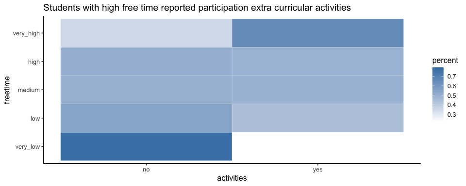
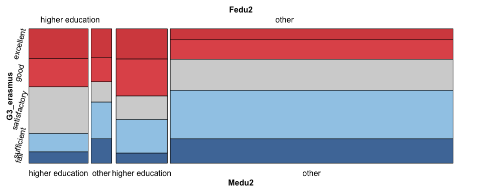

EDAV fall 2018 Final Project (hnt2107\_nm3086\_sdt2134)
================
Hrishikesh Telang, Naoto Minakawa, Somendra Tripathi
12/10/2018

1. Introduction
===============

### 1.1 Motivation

Grades are obviously one of biggest concern during student lives. To make the most of our lives at Columbia DSI, we wanted to analyze what factors are associated with better grades.

### 1.2 Questions which we are interested in studying

We made several guesses before exploratory data analysis.

As positive factors to grade, we made following guessses.

-   Students’ grades are higher
    -   If study time is longer
    -   If they get support from family or school
    -   If parents took higher education

As negative factors to grade, we made following guessses.

-   Students’ grades are lower
    -   If students consume more alcohol
    -   If students are frequently absent from school

### 1.3 Team Member and Individual Contribution to Project

Our team consists of Hrishikesh Telang, Naoto Minakawa, and Somendra Tripathi. For exploratory data analysis (EDA) part, we categorize variables into several groups as mentioned in detail later at 3.2. Each individual conduct EDA for assigned group of variables. After EDA, Hrishkesh implemented interactive chart in D3/Shiny, Somendra conducted further EDA, Naoto gathered materials to create report. Finally, we reviewed our consolidated work and created executive summary. We regularly discussed issues and progress so that we can be on the same page.

2. Description of data
======================

### 2.1 The Brief Explanation of Dataset

We chose Student Performance Data Set which is provided on UC Irvine Machine Learning Repository. The data were obtained in a survey of students at math and Portuguese language courses in secondary school. It contains a lot of interesting social, gender and study information about students. Some variables are associated with the questions we are interested in. There are several (382) students that belong to both datasets.

(Source)

<https://archive.ics.uci.edu/ml/datasets/student+performance>

<http://www3.dsi.uminho.pt/pcortez/student.pdf>

### 2.2 Data Attributes

Attributes for both student-mat.csv (Math course) and student-por.csv (Portuguese language course) datasets are as follows; The definition of attributes are cited from original source.

1.  school - student's school (binary: 'GP' - Gabriel Pereira or 'MS' - Mousinho da Silveira)
2.  sex - student's sex (binary: 'F' - female or 'M' - male)
3.  age - student's age (numeric: from 15 to 22)
4.  address - student's home address type (binary: 'U' - urban or 'R' - rural)
5.  famsize - family size (binary: 'LE3' - less or equal to 3 or 'GT3' - greater than 3)
6.  Pstatus - parent's cohabitation status (binary: 'T' - living together or 'A' - apart)
7.  Medu - mother's education (numeric: 0 - none, 1 - primary education (4th grade), 2 – 5th to 9th grade, 3 – secondary education or 4 – higher education)
8.  Fedu - father's education (numeric: 0 - none, 1 - primary education (4th grade), 2 – 5th to 9th grade, 3 – secondary education or 4 – higher education)
9.  Mjob - mother's job (nominal: 'teacher', 'health' care related, civil 'services' (e.g. administrative or police), 'at\_home' or 'other')
10. Fjob - father's job (nominal: 'teacher', 'health' care related, civil 'services' (e.g. administrative or police), 'at\_home' or 'other')
11. reason - reason to choose this school (nominal: close to 'home', school 'reputation', 'course' preference or 'other')
12. guardian - student's guardian (nominal: 'mother', 'father' or 'other')
13. traveltime - home to school travel time (numeric: 1 - &lt;15 min., 2 - 15 to 30 min., 3 - 30 min. to 1 hour, or 4 - &gt;1 hour)
14. studytime - weekly study time (numeric: 1 - &lt;2 hours, 2 - 2 to 5 hours, 3 - 5 to 10 hours, or 4 - &gt;10 hours)
15. failures - number of past class failures (numeric: n if 1&lt;=n&lt;3, else 4)
16. schoolsup - extra educational support (binary: yes or no)
17. famsup - family educational support (binary: yes or no)
18. paid - extra paid classes within the course subject (Math or Portuguese) (binary: yes or no)
19. activities - extra-curricular activities (binary: yes or no)
20. nursery - attended nursery school (binary: yes or no)
21. higher - wants to take higher education (binary: yes or no)
22. internet - Internet access at home (binary: yes or no)
23. romantic - with a romantic relationship (binary: yes or no)
24. famrel - quality of family relationships (numeric: from 1 - very bad to 5 - excellent)
25. freetime - free time after school (numeric: from 1 - very low to 5 - very high)
26. goout - going out with friends (numeric: from 1 - very low to 5 - very high)
27. Dalc - workday alcohol consumption (numeric: from 1 - very low to 5 - very high)
28. Walc - weekend alcohol consumption (numeric: from 1 - very low to 5 - very high)
29. health - current health status (numeric: from 1 - very bad to 5 - very good)
30. absences - number of school absences (numeric: from 0 to 93)

These grades are related with the course subject, Math or Portuguese:

1.  G1 - first period grade (numeric: from 0 to 20)
2.  G2 - second period grade (numeric: from 0 to 20)
3.  G3 - final grade (numeric: from 0 to 20, output target)

Additional note: there are several (382) students that belong to both datasets. These students can be identified by searching for identical attributes that characterize each student, as shown in the annexed R file.

3. Analysis of data quality
===========================

``` r
# Install packages
library(tidyverse)
library(ggbeeswarm)
library(ggthemes)
library(ggridges)
library(GGally)
library(cluster)
library(carData)
library(extracat)
library(pgmm)
library(vcd)

# Load datasets
student_por <- read_csv('student-por.csv')
student_mat <- read_csv('student-mat.csv')

# Set theme
theme_set(c(theme_classic(12),plot.title = element_text(face = "bold", size = 12) 
            ,plot.subtitle = element_text(face = "bold", color = "grey35", size = 11) 
            ,plot.caption = element_text(color = "grey68",size=5)
            ,axis.text = element_text(size=10)))
```

### 3.1 Observation on dataset

Student file contains the following number of observations :

-   Mathematics : 395
-   Portuguese : 677
-   Both : 382

We focused on analyzing only datasets of students at Portuguese course, because we concluded behaviour of two datasets (student-mat.csv and studenty-por.csv) are alike as well as we found there are some data issues as mentioned in 3.3.

For the first reason, although some students have performed poorly in mathematics and have managed a passing score in Portuguese, two variables are positively correlated.

``` r
# Merge math and Portuguese students data
student_both=merge(student_mat,student_por,by=c("school","sex","age","address","famsize","Pstatus","Medu",
                                                "Fedu","Mjob","Fjob","reason","nursery","internet"))
#print(nrow(student_both)) # 382 students

# Plot correlation
ggplot(student_both, aes(G3.x,G3.y,color = "blue"))+
  geom_jitter() + 
  theme(legend.position = "none") +
  xlab("Maths grade") +
  ylab("Portuguese grade") +
  ggtitle("Correlation between grades in Maths & Portuguese")
```


Secondly, distribution of grades are alike at Math course and Portuguese course.

``` r
p_por <- student_por %>%
  mutate(grade = as.factor(G3)) %>%
  group_by(grade) %>%
  summarise(freq = n()) %>%
  ggplot() +
  geom_histogram(aes(x = grade ,y = freq), stat = 'identity') +
  ggtitle("Portuguese : Frequency of students")+
  xlab("Final Grade") +
  ylab("Number of students")
```

    ## Warning: Ignoring unknown parameters: binwidth, bins, pad

``` r
p_mat <- student_mat %>%
  mutate(grade = as.factor(G3))%>%
  group_by(grade) %>%
  summarise(freq = n()) %>%
  ggplot() +
  geom_histogram(aes(x = grade ,y = freq), stat = 'identity') +
  ggtitle("Mathematics : Frequency of students")+
  xlab("Final Grade") +
  ylab("Number of students")
```

    ## Warning: Ignoring unknown parameters: binwidth, bins, pad

``` r
gridExtra::grid.arrange(p_por,p_mat,ncol=2)
```


### 3.2 Categorization of Data Attributes

As mentioned in 1.3, we categorized data attributes in 2.2 into several groups so that individual team member can explore different group of attributes. The dataset is not so large, however, there are 30 attirbutes which may be associated with grades. We agreed on approach slice and dice data strategically.

Following is our definiton of categorization;

1.  Home environment

    We regard that following attritbutes are related to home environment. Except for studytime, we agreed such attributes are straightforwardly related to home environments, because they are exogenously given to students and related to home. We discussed that studytime is not exogenously given, but something that students have controlability. However, studytime does not fit into any other categories and it is indeed related to home environment. Therefore, we concluded that studytime is best possible fit to this category.

    -   famrel
    -   internet
    -   studytime
    -   traveltime
    -   Pstatus
    -   address
    -   famsize

2.  Social

    We regard that following attritbutes are students' social activties. Regarding alcohol consmuption, we concluded that students consume alcohol through social events such as networking, so we categorized into this group.

    -   freetime
    -   goout
    -   Dalc
    -   Walc
    -   romantic

3.  Parents

    We agreed that it is quite natural to conclude following attritbutes are related to parents.

    -   Medu
    -   Fedu
    -   Mjob
    -   Fjob
    -   guardian

4.  Profile

    We defined profile as something inherently given to students or something which represents conditions for students. We agreed that following attritbutes are related to profile.

    -   sex
    -   age
    -   health

5.  Academics

    We included following attributes in Academics group. We discussed if we should categorize activities into Social group. However, given that activites is extra-curricular activities, we thought it is more related to academics than to social activites.

    -   G1
    -   G2
    -   G3
    -   absences
    -   school
    -   failures
    -   activities

6.  Others

    Following attributes in this group are something we thought does not fit well into any of above groups. Therefore, we created one group called Others and categorized following attributes.

    -   reason
    -   higher
    -   schoolsup
    -   famsup
    -   paid
    -   nursery

### 3.3 Issues with the dataset

We found some issues during data quality analysis. According to data source, there are 382 overlapping students in math course and Portuguese course. Such overlapping students has to be unique.

However, when we tried to join math course data set and Portuguese some of students data appeared not to be unique. Specifically, when we tried to join students by using school, sex, age, address, famsize, Pstatus, Medu, Fedu, Mjob, Fjob, reason, nursery, internet as keys, some fo columns showed different values.

We found that values in such columns were obtained through interview questions to students, and concluded that there may be some human error in answering questions, resulting in different answers by the same students.

Therefore, we decided to focus only on Portuguese course students by observing that students grades in Portuguese class are almost identical to that of math courses.

4 Main analysis (Exploratory Data Analysis)
===========================================

### 4.1 Our Approach

As mentioned in 3.2, we categorized 30 attirbutes into 6 groups and individual explored different groups. We will show interesting results per individual group as shown below .

### 4.2 Data Cleaning

We converted GPA - G3, G2, G1 to erasmus system described in the paper, since it was more clear to understand. The paper suggests that G3, G2, G1 corresponeds to following level in Portugal/France.

-   16-20: excellent/very good
-   14-15: good
-   12-13: satisfactory
-   10-11: sufficient
-   0-9: fail

``` r
student_por <- student_por %>%
  mutate(G3_erasmus = if_else(G3>=16, 'excellent',
                            if_else(G3>=14&G3<=15, 'good',
                                    if_else(G3>=12&G3<=13, 'satisfactory',
                                            if_else(G3>=10&G3<=11, 'sufficient',
                                                    'fail'))))) %>%
  mutate(G3_erasmus = factor(G3_erasmus,
                             c('excellent','good','satisfactory','sufficient','fail')))
```

### 4.3.1 Analysis for Home Environment Group

### 4.3.2 Analysis for Social Group

In social group, Freetime was the most interesting variable which affects grade. From the following chart, we can see lower grade students have higher free time.

``` r
student_por$freetime <- factor(student_por$freetime,
                               labels=c('very_low', 'low', 'medium', 'high', 'very_high'),
                               ordered = TRUE)

student_por %>% 
  group_by(G3_erasmus, freetime) %>%
  tally() %>%
  group_by(freetime) %>%
  mutate(percent = n/sum(n))  %>%
  arrange(desc(G3_erasmus)) %>%
  ggplot(aes(x = freetime, y = percent)) + 
  geom_col(aes(fill = G3_erasmus)) +
  geom_text(aes(label = paste(round(percent,2) * 100,"%",sep = "")),
            position = position_stack(vjust = 0.5)) +
  scale_colour_manual(values = c("#D64E4E","#e15759","#d3d3d3","#a0cbe8","#4e79a7")) +
  scale_fill_manual(values = c("#D64E4E","#e15759","#d3d3d3","#a0cbe8","#4e79a7")) +
  labs(fill = "G3_erasmus") +
  ggtitle("Lower grades with higher free time")
```


Then, we came up with the question - "So what do they do during their free time?". Interestingly, students with high free time reported participation extra curricular activities.

``` r
student_por %>% 
  group_by(activities, freetime) %>% 
  tally() %>%
  group_by(freetime) %>%
  mutate(percent = n/sum(n)) %>%
  ggplot(aes(activities, freetime)) +
  geom_tile(aes(fill = percent), colour = "white") +
  scale_fill_gradient(low = "white",high = "steelblue") +
  ggtitle("Students with high free time reported participation extra curricular activities")
```



We also investigated whether a particular gender report more free time or not. Compared to males, females frequently reported they have lower free time.

``` r
student_por %>%
  group_by(sex, freetime) %>% 
  tally() %>%
  group_by(freetime) %>%
  mutate(percent = n/sum(n)) %>%
  arrange(desc(sex)) %>%
  ggplot(aes(x = freetime, y = percent)) + 
  geom_col(aes(fill = sex)) +
  geom_text(aes(label = paste(round(percent,2) * 100, "%",sep = "")),
            position = position_stack(vjust = 0.5))+
  scale_colour_manual(values = c("#e15759","#a0cbe8")) +
  scale_fill_manual(values = c("#e15759","#a0cbe8")) +
  labs(fill = "sex") +
  ggtitle("Females frequently reported they have low free time")
```


There can be seen another association between students with more free time and goout. Students with a lot of free time goout with friends a lot more.

``` r
student_por$goout <- factor(student_por$goout,
                            labels= c('very_low', 'low', 'medium', 'high', 'very_high'),
                            ordered = TRUE)

student_por %>% 
  group_by(goout, freetime) %>% 
  tally() %>%
  group_by(freetime) %>%
  mutate(percent = n/sum(n)) %>%
  ggplot(aes(goout, freetime)) + geom_tile(aes(fill = percent), colour = "white") +
  scale_fill_gradient(low = "white",high = "steelblue") +
  ggtitle("Students with lots of free time goout with friends a lot more")
```


There are some association between freetime and health. For the students with very low free time, their health condition is worse.

``` r
mosaic(health ~ freetime,student_por,
            gp = gpar(fill = c("#D64E4E","#e15759","#d3d3d3","#a0cbe8","#4e79a7")))
```


This is a sort of obvious association, but we can observe that students have less free time when they take extra paid courses.

``` r
student_por %>%
  group_by(paid, freetime) %>% 
  tally() %>%
  group_by(freetime) %>%
  mutate(percent = n/sum(n)) %>%
  arrange(desc(paid)) %>%
  ggplot(aes(x = freetime, y = percent)) + 
  geom_col(aes(fill = paid)) +
  geom_text(aes(label = paste(round(percent,2) * 100, "%",sep = "")),
            position = position_stack(vjust = 0.5))+
  scale_colour_manual(values = c("#e15759","#a0cbe8")) +
  scale_fill_manual(values = c("#e15759","#a0cbe8")) +
  labs(fill = "Taking paid courses") +
  ggtitle("Less free time for students taking extra paid courses")
```


Regarding if the students are in relationship or not, more females reported to be in relationships.

``` r
student_por %>% 
  group_by(romantic, sex) %>% 
  tally() %>%
  group_by(sex) %>%
  mutate(percent = n/sum(n))  %>%
  arrange(desc(romantic)) %>%
  ggplot(aes(x = sex, y = percent)) + 
  geom_col(aes(fill = romantic)) +
  geom_text(aes(label = paste(round(percent,2) * 100, "%",sep = "")),
            position = position_stack(vjust = 0.5))+
  scale_colour_manual(values = c("#d3d3d3","#e15759")) +
  scale_fill_manual(values = c("#d3d3d3","#e15759")) +
  labs(fill = "In relationship") +
  ggtitle("More females reported to be in relationships")
```


As for distribution of males and females, more females than males studying at the surveyed schools.

``` r
ggplot(student_por, aes(x = sex, fill = sex)) +
  geom_bar() +
  ggtitle("More females than males in the records") +
  scale_fill_manual(values = c("#e15759","#a0cbe8"))+
  ggtitle("More females than males studying at the surveyed schools")
```


Regarding workday/weekend alcohol consumption, we don't see any significant difference among the groups.

``` r
student_por$Dalc <- factor(student_por$Dalc,
                           labels =  c('very_low', 'low', 'medium', 'high', 'very_high'),
                           ordered = TRUE)

student_por %>%
  ggplot(aes(x = Dalc, y = G3)) +
  geom_boxplot(fill="#d3d3d3") +
  ggtitle("No difference in distribution among the groups")
```


``` r
student_por$Walc <- factor(student_por$Walc,
                           labels =  c('very_low', 'low', 'medium', 'high', 'very_high'),
                           ordered = TRUE)

student_por %>%
  ggplot(aes(x = Walc, y = G3)) +
  geom_boxplot(fill="#d3d3d3") +
  ggtitle("No significant difference in distribution among the groups")
```


However, we found something interesting when we also observe whether there are any association between workday/weekend alcohol consumption and grades, splitting data by gender. From the chart, we can see males who consumes alcohol weekend very highly tend to earn worse grades.

``` r
c3 <- ggplot(student_por, aes(x=Dalc, y=G3, color=sex))+
      geom_jitter(alpha=0.8)+
       scale_colour_manual(values=c("#e15759", "#a0cbe8"))+
      xlab("Workday alcohol consumption")+
      ylab("G3")+
      ggtitle("Workday alcohol consumption per school and sex")+
      geom_hline(yintercept=10, linetype="dashed", 
                color = "black", size=1)


c4 <- ggplot(student_por, aes(x=Walc, y=G3, color=sex))+
      geom_jitter(alpha=0.8)+
       scale_colour_manual(values=c("#e15759", "#a0cbe8"))+
      xlab("Weekend alcohol consumption")+
      ylab("G3")+
      ggtitle("Weekend alcohol consumption per school and sex")+
      geom_hline(yintercept=10, linetype="dashed", 
                color = "black", size=1)


gridExtra::grid.arrange(c3,c4, nrow=2)
```


This is for fun. What a coincidence this is! Look at where alcohol consumption is very high.

``` r
ggplot(student_por, aes(x=Dalc, y=absences, fill=Dalc))+
      geom_violin()+
      scale_fill_manual(values = c("#d3d3d3","#d3d3d3","#d3d3d3","#d3d3d3","#ff4e50"))+
      theme(legend.position="none")+
      xlab("Alcohol consumption")+
      ylab("#absences") +
      ggtitle("This is a coincidence!")
```


### 4.3.3 Analysis for Parents Group

We observed parents occupation and education background affects students grade. We will introduce analysis results followingly.

First of all, students whose parents job is teacher performs better than other students.

Regarding father's job, students whose father is teacher performs significantly better than other students. Students whose father is working in health industry performs relatively well.

``` r
mosaic(G3_erasmus ~ Fjob,student_por,
            gp = gpar(fill = c("#D64E4E","#e15759","#d3d3d3","#a0cbe8","#4e79a7")),
            rot_labels=c(45,0,0,75),
            direction=c("v","h"))
```


Similarly, students whose mother is teacher performs significantly better than other students. Students whose mother is working in health industry performs also well, whereas the effect of parents job to be health related is not so significant in father's job case.

``` r
mosaic(G3_erasmus ~ Mjob,student_por,
            gp = gpar(fill = c("#D64E4E","#e15759","#d3d3d3","#a0cbe8","#4e79a7")),
            rot_labels=c(45,0,0,75),
            direction=c("v","h"))
```


Secondly, parent education is also associated with students' grade. As indicated in 2.2, the larger number means the higher education.

When father took higher education, students perform better in their grades. In the chart below, we can see students grades become better, as father's education goes higher.

``` r
mosaic(G3_erasmus ~ Fedu,student_por,
            gp = gpar(fill = c("#D64E4E","#e15759","#d3d3d3","#a0cbe8","#4e79a7")),
            rot_labels=c(0,0,0,75),
            direction=c("v","h"))
```


Similarly, when mother took higher education, students perform better in their grades.

``` r
mosaic(G3_erasmus ~ Medu,student_por,
            gp = gpar(fill = c("#D64E4E","#e15759","#d3d3d3","#a0cbe8","#4e79a7")),
            rot_labels=c(0,0,0,75),
            direction=c("v","h"))
```


From the chart below, it appears to be important that at least either mother or father took higher education. When both parents did not take higher education, students grades appears to be worse than other case. We can oberve this by looking at the most right combination (Fedu2=other and Medu2=other).

``` r
student_por <- student_por %>%
  mutate(Medu2=if_else(Medu==4, 'higher education','other')) %>%
  mutate(Fedu2=if_else(Fedu==4, 'higher education','other'))

mosaic(G3_erasmus ~ Fedu2+Medu2,student_por,
            gp = gpar(fill = c("#D64E4E","#e15759","#d3d3d3","#a0cbe8","#4e79a7")),
            rot_labels=c(0,0,0,75),
            direction=c("v","v","h"))
```



### 4.3.4 Analysis for Profile Group

Overall, this group appears to be not so related to grades performance. Having said that, we will describe what we analyzed as follows.

Regarding sex, we don't see any significant difference between males' and females' grade performance. Grades distribution was almost identical.

``` r
student_por %>%
  ggplot(aes(x = G3)) +
  stat_density(aes(group = sex, color = sex),position="identity",geom="line")
```


Regarding age, we don't see so much difference regarding grade performance among ages. Overall, their average grades are around 12. However, we can that distribution of students grades have less variance as students are younger. Also, for students whose age are 20, we can see the distribution is bimodal.

``` r
student_por %>%
  ggplot(aes(x = G3, y = age, group = age)) +
  geom_density_ridges()
```


As for health, we don't see any significant difference regarding grades performance among students' health condition. Grades distribution was almost identical.

``` r
student_por %>%
  ggplot(aes(x = G3, y = health, group = health)) +
  geom_density_ridges()
```


### 4.3.5 Analysis for Academics Group

### 4.3.6 Analysis for Others Group

Regarding Higher variable, which represents if students want to take higher education, 86% of the students who were not interested in studying further performed poorly. Therefore, motivation for higher education is significantly associated with grades performance.

``` r
student_por %>% 
  group_by(G3_erasmus, higher) %>%
  tally() %>%
  ggplot(aes(G3_erasmus, higher)) + 
  geom_point(aes(size = n,fill = higher, color = higher)) + 
  xlab("Grade3 (Erasmus scale)") +
  ylab("Interested in higher studies") +
  scale_size_continuous(range=c(10,30)) + 
  geom_text(aes(label = n)) + 
  theme(legend.position = "none") +
  scale_color_manual(values = alpha(c("#e15759","#4e79a7"),c(0.9,0.05)))+
  ggtitle("86% of the Students who were not interested in studying further performed poorly")
```


Regarding Reason, which is reason to choose this school, School GP has a better reputation over MS.

``` r
student_por %>%
  ggplot(aes(x = reason)) +
  geom_bar(fill="#d3d3d3") +
  facet_wrap(~school) +
  ggtitle("School \"GP\" has a better reputation over \"MS\"")
```


We analyzed what rural and urban kids value while choosing a school. In the chart below, we can see urban students who valued school for its reputation performed better.

``` r
student_por$address[student_por$address == 'U'] <- "Urban"
student_por$address[student_por$address == 'R'] <- "Rural"

student_por %>%
  ggplot(aes(x = reason, y = G3)) +
  facet_wrap(~address) +
  geom_boxplot(fill="#d3d3d3") +
  ggtitle("Urban students who valued school for its reputation performed better")
```


The following chart shows if school reputation is linked to higher study time. Students who values school reputation tend to have higher studytime.

``` r
student_por$studytime <- factor(student_por$studytime,
                                labels =  c('very_low', 'low', 'medium', 'high'),
                                ordered = TRUE)

student_por %>% 
  group_by(studytime, reason) %>%
  tally() %>%
  group_by(reason) %>%
  mutate(percent = n/sum(n))  %>%
  arrange(desc(studytime)) %>%
  ggplot(aes(x = reason, y = percent)) + 
  geom_col(aes(fill = studytime)) +
  geom_text(aes(label = paste(round(percent,2) * 100, "%",sep = "")),
            position = position_stack(vjust = 0.5))+
  scale_colour_manual(values = c("#D64E4E","#F2CAC1","#d3d3d3","#a0cbe8","#4e79a7")) +
  scale_fill_manual(values = c("#D64E4E","#F2CAC1","#d3d3d3","#a0cbe8","#4e79a7")) +
  labs(fill = "studytime") +
  ggtitle("Higher studytime for student who value school's reputation")
```


Regarding schoolup (school suppport) variable, students who recieved educational support from school showed lower grades. We don't have any reason to assume causality in either direction. Also, very few students getting education support from school.

``` r
box <- student_por %>%
  ggplot(aes(x = schoolsup, y = G3)) +
  geom_boxplot(fill="#d3d3d3") +
  ggtitle("Lower grades for students who recieved educational support from school",
          subtitle = "No reason to assume causality in either direction")

bar <- student_por %>%
  ggplot(aes(x = schoolsup)) +
  geom_bar(fill="#d3d3d3") +
  ggtitle("Very few students getting education support from school")

gridExtra::grid.arrange(box,bar, nrow=1,ncol=2)
```


As for famsup (family support) and romantic (in a romantic relationship), we don't see any difference between two groups.

``` r
student_por %>%
  ggplot(aes(x = famsup, y = G3)) +
  geom_boxplot(fill="#d3d3d3") +
  ggtitle("No difference in distribution between the two groups")
```


``` r
student_por %>%
  ggplot(aes(x = romantic, y = G3)) +
  geom_boxplot(fill="#d3d3d3") +
  ggtitle("No difference in distribution between the two groups")
```


### 4.4 Challenges

5. Executive summary (Presentation-style)
=========================================

Please find an executive summary for this URL.

6. Interactive component
========================

Please find an interactive chart for this URL.
