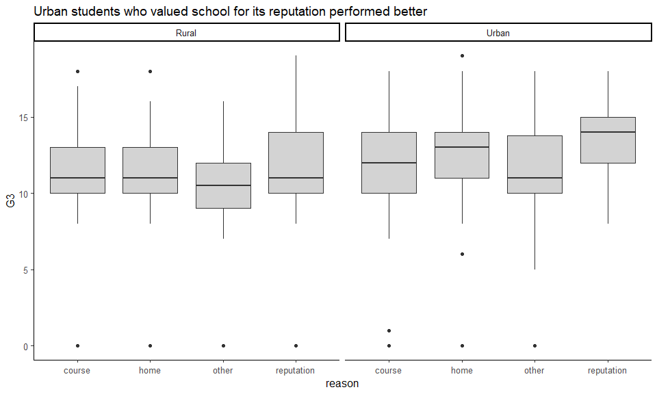

``` r
library(ggbeeswarm)
library(cluster)
library(tidyverse)
library(ggthemes)
library(carData)
library(extracat)
library(pgmm)
library(GGally)
library(vcd)

student_por <- read_csv('student-por.csv')
student_mat <- read_csv('student-mat.csv')


theme_set(c(theme_classic(12),plot.title = element_text(face = "bold", size = 12) 
            ,plot.subtitle = element_text(face = "bold", color = "grey35", size = 11) 
            ,plot.caption = element_text(color = "grey68",size=5)
            ,axis.text = element_text(size=10)))
```

##### Reference to the paper

[USING DATA MINING TO PREDICT SECONDARY SCHOOL STUDENT PERFORMANCE](http://www3.dsi.uminho.pt/pcortez/student.pdf)

##### Student file contains the following number of observations :

-   Mathematics : 395
-   Portuguese : 677
-   Both : 382

##### Although some students have performed poorly in mathematics and have managed a passing score in portuguese, two variables are positively correlated

``` r
student_both=merge(student_mat,student_por,by=c("school","sex","age","address","famsize","Pstatus","Medu",
                                                "Fedu","Mjob","Fjob","reason","nursery","internet"))
#print(nrow(student_both)) # 382 students

ggplot(student_both, aes(G3.x,G3.y,color = "blue"))+
  geom_jitter() + 
  theme(legend.position = "none") +
  xlab("Maths grade") +
  ylab("Portuguese grade") +
  ggtitle("Correlation between grades in Maths & Portuguese")
```


##### Distribution of grades

``` r
p_por <- student_por %>% mutate(grade = as.factor(G3)) %>%
group_by(grade) %>% summarise(freq = n()) %>%
ggplot() +
geom_histogram(aes(x = grade ,y = freq), stat = 'identity') +
ggtitle("Portuguese : Frequency of students")+
xlab("Final Grade") + ylab("Number of students")
```

    ## Warning: Ignoring unknown parameters: binwidth, bins, pad

``` r
p_mat <- student_mat %>% mutate(grade = as.factor(G3))%>%
group_by(grade) %>% summarise(freq = n()) %>%
ggplot() +
geom_histogram(aes(x = grade ,y = freq), stat = 'identity') +
ggtitle("Mathematics : Frequency of students")+
xlab("Final Grade") + ylab("Number of students")
```

    ## Warning: Ignoring unknown parameters: binwidth, bins, pad

``` r
gridExtra::grid.arrange(p_por,p_mat,ncol=2)
```


##### Coverting GPA - G3, G2, G1 to erasmus system discribed in the paper

### 1) Freetime : Portuguese students only

``` r
student_por$freetime <- factor(student_por$freetime,labels =  c('very_low', 'low', 'medium', 'high', 'very_high'),ordered = TRUE)

student_por %>% 
  group_by(G3_erasmus, freetime) %>% tally() %>%
  group_by(freetime) %>%
  mutate(percent = n/sum(n))  %>%
  arrange(desc(G3_erasmus)) %>%
  
  ggplot(aes(x = freetime, y = percent)) + 
  
  geom_col(aes(fill = G3_erasmus)) +
  geom_text(aes(label = paste(round(percent,2) * 100, "%",sep = "")),position = position_stack(vjust = 0.5))+
  scale_colour_manual(values = c("#D64E4E","#e15759","#d3d3d3","#a0cbe8","#4e79a7")) +
  scale_fill_manual(values = c("#D64E4E","#e15759","#d3d3d3","#a0cbe8","#4e79a7")) +
  labs(fill = "G3_erasmus") +
  ggtitle("Lower grades with higher free time")
```


##### So what do they do during their free time?

``` r
student_por %>% group_by(activities, freetime) %>% 
  tally() %>%
  group_by(freetime) %>%
  mutate(percent = n/sum(n)) %>%
  
  ggplot(aes(activities, freetime)) + geom_tile(aes(fill = percent),
  colour = "white") + scale_fill_gradient(low = "white",high = "steelblue") +
  ggtitle("Students with high free time reported participation extra curricular activities")
```


##### Does a particular gender report more free time?

``` r
student_por %>% group_by(sex, freetime) %>% 
  tally() %>%
  group_by(freetime) %>%
  mutate(percent = n/sum(n)) %>%
  arrange(desc(sex)) %>%
  ggplot(aes(x = freetime, y = percent)) + 
  
  geom_col(aes(fill = sex)) +
  geom_text(aes(label = paste(round(percent,2) * 100, "%",sep = "")),position = position_stack(vjust = 0.5))+
  scale_colour_manual(values = c("#e15759","#a0cbe8")) +
  scale_fill_manual(values = c("#e15759","#a0cbe8")) +
  labs(fill = "sex") +
  ggtitle("Females frequently reported they have low free time")
```


##### Do they go out with friends?

``` r
student_por$goout <- factor(student_por$goout,labels =  c('very_low', 'low', 'medium', 'high', 'very_high'),ordered = TRUE)


student_por %>% group_by(goout, freetime) %>% 
  tally() %>%
  group_by(freetime) %>%
  mutate(percent = n/sum(n)) %>%
  
  ggplot(aes(goout, freetime)) + geom_tile(aes(fill = percent),
  colour = "white") + scale_fill_gradient(low = "white",high = "steelblue") +
  ggtitle("Students with loads of free time goout with friends a lot more")
```


##### Any association between freetime and health?

``` r
mosaic(health ~ freetime,student_por,
            gp = gpar(fill = c("#D64E4E","#e15759","#d3d3d3","#a0cbe8","#4e79a7")))
```


##### Paid courses?

``` r
student_por %>% group_by(paid, freetime) %>% 
  tally() %>%
  group_by(freetime) %>%
  mutate(percent = n/sum(n)) %>%
  arrange(desc(paid)) %>%
  ggplot(aes(x = freetime, y = percent)) + 
  
  geom_col(aes(fill = paid)) +
  geom_text(aes(label = paste(round(percent,2) * 100, "%",sep = "")),position = position_stack(vjust = 0.5))+
  scale_colour_manual(values = c("#e15759","#a0cbe8")) +
  scale_fill_manual(values = c("#e15759","#a0cbe8")) +
  labs(fill = "Taking paid courses") +
  ggtitle("Less free time for students taking extra paid courses")
```


### 2) Higher : Wants to take higher education (binary: yes or no) (Portuguese students only)

``` r
#Plot the Data

student_por %>% 
  group_by(G3_erasmus, higher) %>% tally() %>%
ggplot(aes(G3_erasmus, higher)) + 
geom_point(aes(size = n,fill = higher, color = higher)) + 
xlab("Grade3 (Erasmus scale)") + ylab("Interested in higher studies") +
scale_size_continuous(range=c(10,30)) + 
geom_text(aes(label = n)) + 
theme(legend.position = "none") +
scale_color_manual(values = alpha(c("#e15759","#4e79a7"),c(0.9,0.05)))+
  ggtitle("86% of the Students who were not interested in studying further performed poorly")
```


### 3) Reason : reason to choose this school (binary: yes or no) (Portuguese students only)

``` r
student_por %>%
  ggplot(aes(x = reason)) +
  geom_bar(fill="#d3d3d3") +
  facet_wrap(~school) +
  ggtitle("School \"GP\" has a better reputation over \"MS\"")
```


##### What do rural and urban kids value while choosing a school school?

``` r
student_por$address[student_por$address == 'U'] <- "Urban"
student_por$address[student_por$address == 'R'] <- "Rural"

student_por %>%
  ggplot(aes(x = reason, y = G3)) +
  facet_wrap(~address) +
  geom_boxplot(fill="#d3d3d3") +
  ggtitle("Urban students who valued school for its reputation performed better")
```



##### Reputation - linked to higher study time?

``` r
student_por$studytime <- factor(student_por$studytime,labels =  c('very_low', 'low', 'medium', 'high'),ordered = TRUE)


student_por %>% 
  group_by(studytime, reason) %>% tally() %>%
  group_by(reason) %>%
  mutate(percent = n/sum(n))  %>%
  arrange(desc(studytime)) %>%
  
  ggplot(aes(x = reason, y = percent)) + 
  
  geom_col(aes(fill = studytime)) +
  geom_text(aes(label = paste(round(percent,2) * 100, "%",sep = "")),position = position_stack(vjust = 0.5))+
  scale_colour_manual(values = c("#D64E4E","#F2CAC1","#d3d3d3","#a0cbe8","#4e79a7")) +
  scale_fill_manual(values = c("#D64E4E","#F2CAC1","#d3d3d3","#a0cbe8","#4e79a7")) +
  labs(fill = "studytime") +
  ggtitle("Higher studytime for student who value school's reputation")
```


##### 4) schoolsup : extra educational support (binary: yes or no)

###### Final grade of student with school support

###### gridchart to show freq + percent

``` r
box <- student_por %>%
ggplot(aes(x = schoolsup, y = G3)) +
geom_boxplot(fill="#d3d3d3") +
ggtitle("Lower grades for students who recieved educational support from school", subtitle = "No reason to assume causality in either direction")
  

bar <- student_por %>%
ggplot(aes(x = schoolsup)) +
geom_bar(fill="#d3d3d3") +
ggtitle("Very few students getting education support from school")


gridExtra::grid.arrange(box,bar, nrow=1,ncol=2)
```


##### 5) famsup : family educational support (binary: yes or no)

###### gridchart to show freq + percent

``` r
student_por %>%
ggplot(aes(x = famsup, y = G3)) +
geom_boxplot(fill="#d3d3d3") +
ggtitle("No difference in distribution between the two groups")
```


``` r
#gridExtra::grid.arrange(box,bar, nrow=1,ncol=2)
```

##### 6) romantic : in a romantic relationship (binary: yes or no)

##### Did being in a relationship affect final grade?

``` r
student_por %>%
ggplot(aes(x = romantic, y = G3)) +
geom_boxplot(fill="#d3d3d3") +
ggtitle("No difference in distribution between the two groups")
```


##### Which sex reported relationships?

``` r
student_por %>% 
  group_by(romantic, sex) %>% tally() %>%
  group_by(sex) %>%
  mutate(percent = n/sum(n))  %>%
  arrange(desc(romantic)) %>%
  
  ggplot(aes(x = sex, y = percent)) + 
  
  geom_col(aes(fill = romantic)) +
  geom_text(aes(label = paste(round(percent,2) * 100, "%",sep = "")),position = position_stack(vjust = 0.5))+
  scale_colour_manual(values = c("#d3d3d3","#e15759")) +
  scale_fill_manual(values = c("#d3d3d3","#e15759")) +
  labs(fill = "In relationship") +
  ggtitle("More females reported to be in relationships")
```


##### Distribution of males and females

``` r
ggplot(student_por, aes(x = sex, fill = sex)) +
  geom_bar() +
  ggtitle("More females than males in the records") +
  scale_fill_manual(values = c("#e15759","#a0cbe8"))+
  ggtitle("More females than males studying at the surveyed schools")
```


##### 7) Dalc : workday alcohol consumption (numeric: from 1 - very low to 5 - very high)

``` r
student_por$Dalc <- factor(student_por$Dalc,labels =  c('very_low', 'low', 'medium', 'high', 'very_high'),ordered = TRUE)


student_por %>%
ggplot(aes(x = Dalc, y = G3)) +
geom_boxplot(fill="#d3d3d3") +
ggtitle("No difference in distribution between the two groups")
```


##### Dalc split by gender

``` r
ggplot(student_por, aes(x = Dalc, y = G3, color = sex)) + 
  facet_wrap(~sex)+
  geom_beeswarm(priority='density',cex=1) +
  scale_color_manual(values = c("#e15759","#a0cbe8")) +
  theme(legend.position = "none") +
  ggtitle("XXXX")
```


``` r
student_por %>%
ggplot(aes(x = Dalc, y = G3)) +
facet_wrap(~sex)+
geom_boxplot(fill="#d3d3d3") +
ggtitle("No difference in distribution between the two groups")
```


##### 8) Walc : weekend alcohol consumption (numeric: from 1 - very low to 5 - very high)

``` r
student_por$Walc <- factor(student_por$Walc,labels =  c('very_low', 'low', 'medium', 'high', 'very_high'),ordered = TRUE)


student_por %>%
ggplot(aes(x = Walc, y = G3)) +
geom_boxplot(fill="#d3d3d3") +
ggtitle("xxx")
```


##### Walc split by gender

``` r
ggplot(student_por, aes(x = Walc, y = G3, color = sex)) + 
  facet_wrap(~sex)+
  geom_beeswarm(priority='density',cex=1) +
  scale_color_manual(values = c("#e15759","#a0cbe8")) +
  theme(legend.position = "none")+
  ggtitle("XX")
```


``` r
student_por %>%
ggplot(aes(x = Walc, y = G3)) +
facet_wrap(~sex)+
geom_boxplot(fill="#d3d3d3") +
  geom_beeswarm(priority='density',cex=1) +
ggtitle("XXX")
```


